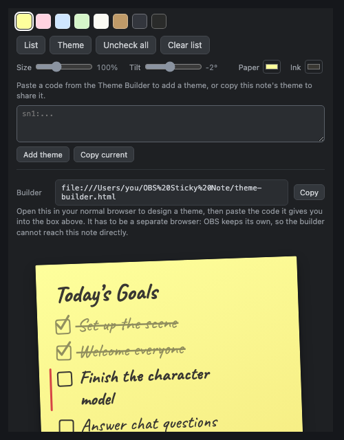

# OBS Sticky Note

A sticky-note checklist for your stream. Viewers watch items get crossed off on
an overlay while you check them off from a panel docked inside OBS. One HTML
file, no server to run. Works offline, and your list survives OBS restarts.


## What you download

Two files, each self-contained. Neither needs a build step or an internet
connection.

| File | What it's for |
|---|---|
| `sticky-note.html` | The note. Loads twice in OBS: once as your control dock, once as the on-stream overlay. |
| `theme-builder.html` | Optional. Open it in a normal browser to design a look, then paste the code it gives you into the dock. |

## Setup (once, about 2 minutes)

You load `sticky-note.html` twice: once as a **dock** (your control panel) and
once as a **browser source** (what viewers see). Both need a `file:///` URL,
and it must be the same URL in both places or they won't sync.

The URL looks like this (write spaces in the path as `%20`):

```
file:///Users/you/path%20to/sticky-note.html
```

To skip typing it by hand, double-click `sticky-note.html`. It opens in your
browser and shows both ready-made URLs with Copy buttons. The dock shows the
same URLs at the bottom of its panel.

### 1. Add the control dock

1. In OBS: **View → Docks → Custom Browser Docks…**
2. Dock Name: `Sticky Note`
3. URL: your file URL plus `?view=dock`, e.g.
   `file:///Users/you/path%20to/sticky-note.html?view=dock`
4. Click **Apply**, then drag the dock wherever you like in the OBS window.

### 2. Add the on-stream overlay

1. In your scene: **Sources → + → Browser**
2. Uncheck **Local file**. OBS serves local files from a different internal
   origin, and the dock and overlay won't sync if you leave it checked.
3. URL: your file URL with no parameters, e.g.
   `file:///Users/you/path%20to/sticky-note.html`
4. Width `470`, Height `700`, or whatever fits your list. Leave "Shutdown
   source when not visible" unchecked so the note stays live.
5. Position and scale it in your scene like any other source.

Type a task in the dock and the overlay picks it up within a second.

## Using it

All editing happens in the dock:

- **Add a task**: type in the "Add a task" line, press Enter
- **Check off**: click the checkbox. Viewers see the pen-stroke check and
  strikethrough; the item dims but stays visible.
- **Edit**: click any task's text or the title and type. Enter or clicking away
  saves, Esc cancels.
- **Reorder / delete**: hover a task for the ▲ ▼ ✕ buttons
- **Theme**: click a colour swatch in the toolbar
- **Quick tweaks**: the Size, Tilt, Paper, and Ink controls adjust whatever
  theme you're on. Clicking a swatch clears them and puts you back on that
  theme as its author made it.
- **Uncheck all**: resets the checkmarks so you can reuse the list next stream
- **Clear list**: deletes all tasks (click twice to confirm)

Check off the last item and the note wiggles, then an "All done!" stamp
appears.

## Backing up your list

Your tasks live in OBS's browser storage. Clearing OBS's browser cache clears
them too, so keep a copy.

Click **List** in the dock toolbar. **Copy list** gives you a code holding the
title, the tasks, and which are ticked. Park it in a pinned Discord message or
a text file.

**Replace list** and **Add to list** take that code back. They also take plain
text, one task per line:

```
Set up the scene
Welcome everyone
Finish the character model
```

It strips bullets, numbering and markdown checkboxes, so a list you wrote
somewhere else pastes in as it stands:

```
- [x] Set up the scene
- [ ] Welcome everyone
* Check audio levels
1. Start the music
```

A ticked box arrives checked off. Replacing asks twice before it throws away
what you have. Adding can't lose anything, so it goes straight through.

## The item you're on

Click **◉** on a task to mark it as the one you're working on. Viewers see it
picked out with a bar, an arrow, a dot, or a highlight, depending on the theme.

With something marked, **Space** or **Enter** in the dock ticks it off and
moves to the next unfinished task. **Backspace** steps back and un-ticks it,
for when you get ahead of yourself mid-stream.

### Driving it hands-free

Four commands run the list: `advance`, `back`, `reset`, `clear_current`. Each
acts on whatever the list holds at the time, so a button you bind today still
works with next week's list. You never rewire anything.

Three ways to send one, easiest first.

**Keyboard, in the dock.** Space, Enter and Backspace, as above. Nothing to
set up. Typing in a task, the title, or the add box suppresses them.

**An OBS custom event.** Anything that can send obs-websocket a
`CallVendorRequest` with vendor `obs-browser` and request type `emit_event`
can drive the list:

```json
{ "vendorName": "obs-browser",
  "requestType": "emit_event",
  "requestData": { "event_name": "sticky-note",
                   "event_data": { "command": "advance" } } }
```

If your sender can't attach a payload, aim it at `sticky-note-advance`,
`sticky-note-back` or `sticky-note-reset` instead. The dock and the overlay
both listen. Whichever hears it writes the change, and the other picks it up
within a second.

This route needs a tool that can send a raw vendor request. Bitfocus Companion
and the scripting libraries do. Stream Deck plugins vary, so check yours before
you count on it.

**A hidden command source**, when your setup can't send vendor requests. Add a
second Browser source pointing at `sticky-note.html?cmd=advance`, size it 1×1
and hide it. It runs that command on load and draws nothing. Bind an OBS hotkey
to refresh that source and a Stream Deck can fire it by sending the keystroke.
You need one source per command, which is clumsy, but it needs no extra
software.

## Themes

Eight are built in: Classic Yellow, Pink, Blue, Green, Lined Notepad, Kraft,
Midnight, and Asylum Life.


A theme is 77 tokens of data: colour, paper texture, silhouette, the corner
fold, accent brackets and edge rules, fonts, the checkbox, and how a finished
task reads. No CSS anywhere in the project names a theme, so one you write can
do anything the built-ins do.

Asylum Life drops the sticky-note shape for a translucent HUD panel with corner
brackets, square edges, no tilt and an uppercase condensed title. It sets 54
token values and no CSS of its own.

### Making your own

You design a theme in `theme-builder.html` and move it into OBS as a code you
paste.

#### 1. Find the builder from the dock

Click **Theme** in the dock toolbar. The panel that opens holds the paste box
for theme codes, and at the bottom the path to the builder sitting next to your
note:



Hit **Copy**, then paste that path into your browser's address bar.

Open it in your own browser, not inside OBS. Clicking a link in an OBS dock
navigates the dock itself, and you would lose the note. OBS also keeps separate
storage from your browser, which is why a theme moves as a code you paste.

#### 2. Design the theme


Pick a starting point from **Start from…** and adjust. The preview updates as
you go. Buttons along the top drop the note onto a transparent, dark, bright,
or busy background, so you can check it against something closer to your scene
than a flat grey.

**Basics** shows the dozen settings most people want. **Everything** opens all
77, grouped by what they affect.

**Accents**, under Shape, is a diagram of the note. Click any of the four
corners or four edges to put a mark there. Corners get L-shaped brackets, edges
get a rule down that side, and each takes its own colour and weight. Every
theme can use them.

Fields marked **Auto** take their colour from another field: the gradient from
the paper, the checkbox from the ink. Untick to set one yourself.

#### 3. Move it into OBS

Click **Copy code**, go back to the dock's **Theme** panel, paste into the box,
and click **Add theme**. It joins your swatches with a corner tick marking it
as yours, and the overlay picks it up like any other theme. **Remove** deletes
a theme you added; the built-ins can't be removed.

Theme codes are plain text starting `sn1:`, so you can share one in a Discord
message. **Save .json** in the builder writes the same thing to a file, and
**Open .json** reads it back. To hand-write JSON instead, see
[docs/THEMES.md](docs/THEMES.md) for the token reference. The Theme panel takes
that too.

## URL parameters

| Parameter | Effect |
|---|---|
| `?view=dock` | Control-panel mode (editing UI). Without it: overlay mode. |
| `?scale=1.5` | Extra scale multiplier (0.2–5) on top of the Size slider. |
| `?demo=1` | Sample tasks, nothing saved. Good for previewing in a browser. |
| `?demo=all` | Sample tasks all checked, to preview the All-done stamp. |
| `?demo=1&theme=kraft` | Preview a specific theme. |

Combine parameters with `&`, e.g. `?view=dock&scale=1.2`.

## Troubleshooting

**Dock and overlay don't sync**
- The browser source needs **Local file unchecked** and the exact same
  `file:///` URL as the dock. The `?view=dock` suffix should be the only
  difference.
- Right-click the browser source, pick **Refresh cache of current page**, and
  re-open the dock.
- Worst case, skip the dock: right-click the browser source, pick **Interact**,
  and check items off in that window. Add `?view=dock` to the source URL while
  you edit, or keep a second source for interacting.

**Note doesn't appear on stream**
- Check that the source URL starts with `file:///` (three slashes) and that
  spaces in the path are written as `%20`.

**I moved or renamed the file and OBS shows a blank dock/source**
- The OBS URLs still point at the old location. Double-click the file in its
  new spot. It opens in your browser and shows the new Dock and Overlay URLs
  with Copy buttons; paste those into the dock settings and the browser source.
  Your tasks are safe. The list lives in OBS's browser storage, not in the
  file.

**My tasks disappeared**
- OBS stores the list in its browser storage, keyed to the page origin. Moving
  or renaming the file keeps it intact, since all `file://` pages share
  storage, but wiping OBS's browser cache (`plugin_config/obs-browser`) clears
  it.

**A theme code won't paste in**
- The dock takes a `sn1:` code or raw theme JSON and refuses anything else
  outright. Check you copied the whole code. They run to a couple of thousand
  characters and truncate easily.

**Text looks like a generic font**
- The handwriting font is embedded in the HTML. If you see a plain font, an
  editor may have re-saved the file and stripped it. Download the file again.

## Building from source

You only need this if you're changing the project. The two HTML files are
committed, so users never build anything.

```sh
node build.js          # rebuild sticky-note.html and theme-builder.html
node build.js --check  # verify the committed files match src/ (CI runs this)
node tools/check.js    # token system consistency checks
```

No dependencies, no install step, any Node 14 or newer. See
[CONTRIBUTING.md](CONTRIBUTING.md) for how the pieces fit together.

## Licence

MIT for the project's own code. See [LICENSE](LICENSE).

The embedded fonts, Caveat and Barlow, are SIL Open Font License 1.1. Full
texts and attribution are in [licenses/](licenses/).
