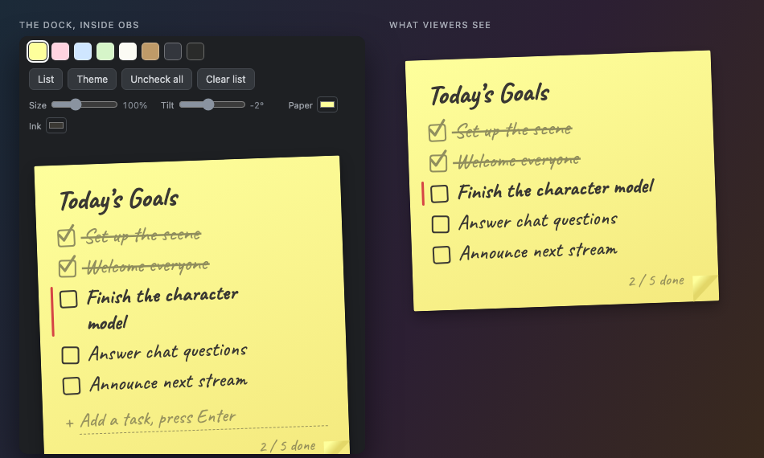
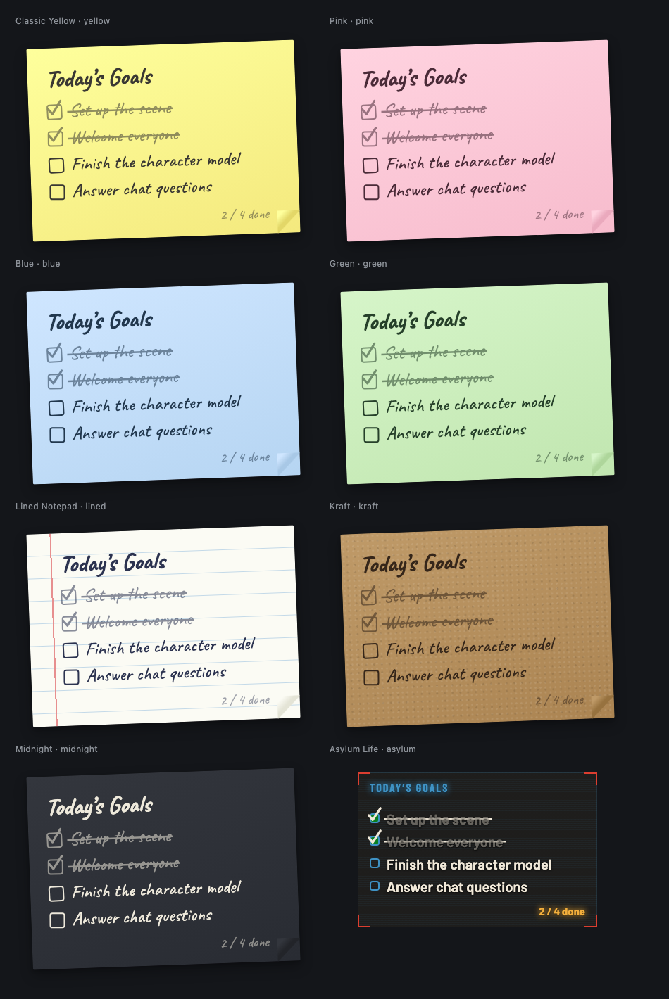
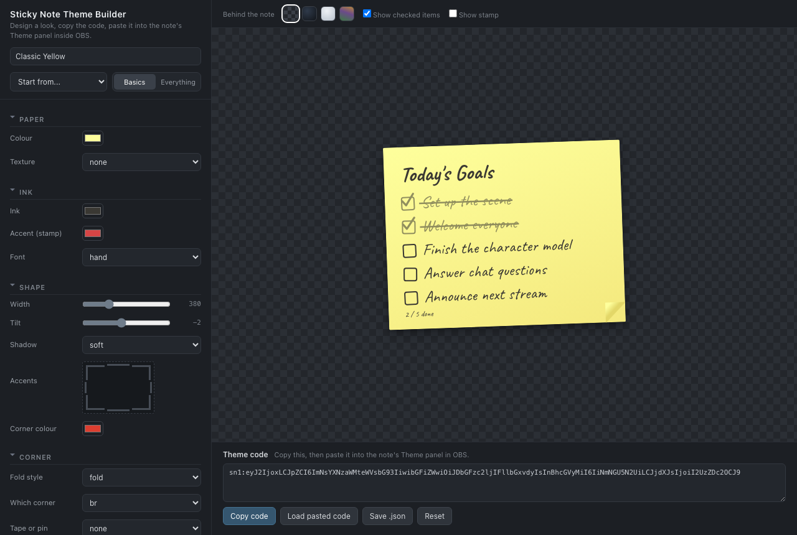

# OBS Sticky Note

A sticky-note checklist for your stream. Viewers watch items get crossed off on
an overlay while you check them off from a panel docked inside OBS. One HTML
file, no server to run. Works offline, and your list survives OBS restarts.



## What you download

Two files, each self-contained. Neither needs a build step or an internet
connection.

| File | What it's for |
|---|---|
| `sticky-note.html` | The note. Loads twice in OBS — once as your control dock, once as the on-stream overlay. |
| `theme-builder.html` | Optional. Open it in a normal browser to design a look, then paste the code it gives you into the dock. |

## Setup (once, about 2 minutes)

You load `sticky-note.html` twice: once as a **dock** (your control panel) and
once as a **browser source** (what viewers see). Both need a `file:///` URL,
and it must be the same URL in both places or they won't sync.

The URL looks like this (write spaces in the path as `%20`):

```
file:///Users/you/path%20to/sticky-note.html
```

To skip typing it by hand, double-click `sticky-note.html`. It opens in your
browser and shows both ready-made URLs with Copy buttons. The dock shows the
same URLs at the bottom of its panel.

### 1. Add the control dock

1. In OBS: **View → Docks → Custom Browser Docks…**
2. Dock Name: `Sticky Note`
3. URL: your file URL plus `?view=dock`, e.g.
   `file:///Users/you/path%20to/sticky-note.html?view=dock`
4. Click **Apply**, then drag the dock wherever you like in the OBS window.

### 2. Add the on-stream overlay

1. In your scene: **Sources → + → Browser**
2. Uncheck **Local file**. OBS serves local files from a different internal
   origin, and the dock and overlay won't sync if you leave it checked.
3. URL: your file URL with no parameters, e.g.
   `file:///Users/you/path%20to/sticky-note.html`
4. Width `470`, Height `700`, or whatever fits your list. Leave "Shutdown
   source when not visible" unchecked so the note stays live.
5. Position and scale it in your scene like any other source.

Type a task in the dock and the overlay picks it up within a second.

## Using it

All editing happens in the dock:

- **Add a task**: type in the "Add a task" line, press Enter
- **Check off**: click the checkbox. Viewers see the pen-stroke check and
  strikethrough; the item dims but stays visible.
- **Edit**: click any task's text or the title and type. Enter or clicking away
  saves, Esc cancels.
- **Reorder / delete**: hover a task for the ▲ ▼ ✕ buttons
- **Theme**: click a colour swatch in the toolbar
- **Quick tweaks**: the Size, Tilt, Paper, and Ink controls adjust whatever
  theme you're on. Clicking a swatch clears them and puts you back on that
  theme as its author made it.
- **Uncheck all**: resets the checkmarks so you can reuse the list next stream
- **Clear list**: deletes all tasks (click twice to confirm)

Check off the last item and the note wiggles, then an "All done!" stamp
appears.

## Themes

Eight are built in: Classic Yellow, Pink, Blue, Green, Lined Notepad, Kraft,
Midnight, and Asylum Life.



A theme is **data, not code** — a set of tokens covering colour, paper texture,
silhouette, how the corner folds, accent brackets and edge rules, the font, the
checkbox, and how a finished task reads. There is no per-theme CSS anywhere in the project, so a theme you
make can do anything a built-in one can. Asylum Life is the proof: it throws
out the sticky-note shape entirely for a semi-transparent HUD panel with corner
brackets, no tilt, no fold, and a condensed uppercase title — and it is still
just 53 token values.

### Making your own



Open **`theme-builder.html`** in your normal browser (not in OBS). Pick a
starting point, adjust what you want, and watch the preview update. You can
preview the note against a transparent, dark, bright, or busy background,
because a note that reads beautifully on grey can vanish over actual video.

**Basics** shows the dozen or so things most people want. **Everything** opens
all 74 tokens.

Under **Shape** you'll find **Accents**: a small diagram of the note where you
click any of the four corners or four edges to toggle a mark there. Corners get
L-shaped brackets, edges get a rule down that side, and the two carry separate
colours and weights — so you can have brackets in one colour with a heavier
rule down the left in another. This works on any theme, not just Asylum Life.

When you're happy, click **Copy code**. Then in OBS, open the dock's **Theme**
panel, paste, and click **Add theme**. It joins your swatches with a corner
tick to mark it as yours, and the overlay picks it up like any other theme.

Theme codes are plain text starting `sn1:`, so you can paste one into a Discord
message to share it. `docs/THEMES.md` has the full token reference if you'd
rather hand-write JSON — the Theme panel accepts that too.

## URL parameters

| Parameter | Effect |
|---|---|
| `?view=dock` | Control-panel mode (editing UI). Without it: overlay mode. |
| `?scale=1.5` | Extra scale multiplier (0.2–5) on top of the Size slider. |
| `?demo=1` | Sample tasks, nothing saved. Good for previewing in a browser. |
| `?demo=all` | Sample tasks all checked, to preview the All-done stamp. |
| `?demo=1&theme=kraft` | Preview a specific theme. |

Combine parameters with `&`, e.g. `?view=dock&scale=1.2`.

## Troubleshooting

**Dock and overlay don't sync**
- The browser source needs **Local file unchecked** and the exact same
  `file:///` URL as the dock. The `?view=dock` suffix should be the only
  difference.
- Right-click the browser source, pick **Refresh cache of current page**, and
  re-open the dock.
- Worst case, skip the dock: right-click the browser source, pick **Interact**,
  and check items off in that window. Add `?view=dock` to the source URL while
  you edit, or keep a second source for interacting.

**Note doesn't appear on stream**
- Check that the source URL starts with `file:///` (three slashes) and that
  spaces in the path are written as `%20`.

**I moved or renamed the file and OBS shows a blank dock/source**
- The OBS URLs still point at the old location. Double-click the file in its
  new spot. It opens in your browser and shows the new Dock and Overlay URLs
  with Copy buttons; paste those into the dock settings and the browser source.
  Your tasks are safe. The list lives in OBS's browser storage, not in the
  file.

**My tasks disappeared**
- OBS stores the list in its browser storage, keyed to the page origin. Moving
  or renaming the file keeps it intact, since all `file://` pages share
  storage, but wiping OBS's browser cache (`plugin_config/obs-browser`) clears
  it.

**A theme code won't paste in**
- The dock accepts a `sn1:` code or raw theme JSON, and rejects anything else
  rather than applying half of it. Make sure you copied the whole code — they
  can run to a couple of thousand characters and are easy to truncate.

**Text looks like a generic font**
- The handwriting font is embedded in the HTML. If you see a plain font, an
  editor may have re-saved the file and stripped it. Download the file again.

## Building from source

You only need this if you're changing the project. The two HTML files are
committed, so users never build anything.

```sh
node build.js          # rebuild sticky-note.html and theme-builder.html
node build.js --check  # verify the committed files match src/ (CI runs this)
node tools/check.js    # token system consistency checks
```

No dependencies and no install step — any Node 14+ will do. See
[CONTRIBUTING.md](CONTRIBUTING.md) for how the pieces fit together.

## Licence

The project's own code is MIT licensed — see [LICENSE](LICENSE).

The embedded fonts — Caveat, Barlow, and Barlow Condensed — are SIL Open Font
License 1.1. Full texts and attribution are in [licenses/](licenses/).
